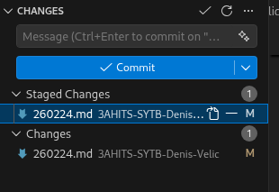

# 📑 Arbeitsbericht (SYTB)


## 👤 Basisinformationen
| **Thema** | GitHub & VScode
| **Fach** | Systemtechnik (SYTB) 


---

## 🛠️ 1. GitHub Configuration

Neue Repository erstellen:

- Auf GitHub klicke auf `create repository`
- Gib den namen für die Repository ein `3AHITS-SYTB-Denis-Velic`
- **Wichtig**: die README Datei aktivieren
- Jetzt kannst du etwas in die README schreiben


## 💻 2. VSCode Installation
- FireFox in Kali öffnen
- `VSCode für Linux` eingeben
- die .deb datei runterladen
- Das in die Shell eingeben:

```sh
sudo apt update
sudo apt install ./code_1.109.5-1771531656_amd64.deb
```
- jetzt sollte VSCode installiert sein geh in die Shell und gib ein:
```sh
code
# dann sollte sich VSCode öffnen 
```

## 🛜 VSCode mit GitHub verbinden
Zuerst musste man die Ordnerstruktur erstellen, damit die Respository von GitHub kopiert wird. Öffne in VSCode eine Shell und gib ein
```sh
git clone https://github.com/Denisovic-Bua/3AHITS-SYTB-Denis-Velic
```

Kopier einfach den Link von deinem Ordner in GitHub und gib ihn ein


## 🌐 3. Git mit VSCode connecten
Hier verbinden wir dann Git mit VSCode um live updates von deinen MD files

- In VSCode gehe zum Source Control Tab


- Gib eine Commit message ein z.B.: `NeuerBericht`
- Click auf die Datei die du Commiten willst
- Danach kommt ein Pop-Up das der User nicht verbunden ist
- Gib das dann in die Shell in VS ein:
```sh
git config --global user.name "Denis Velic" 
git config --global user.email denis.velic@htl-braunau.at
```
Dann kommt wieder ein Pop-Up wo du dein GitHub Account mit VSCode verbinden musst, sobald das gemacht ist kannst du auf Commit drücken und dann auf Sync.

Wenn du jetzt auf dein Repository in GitHub gehst, siehst du , dass neue Berichte hinzugefügt werden oder geupdated werden immer wenn du einen Bericht commitest und syncyst
